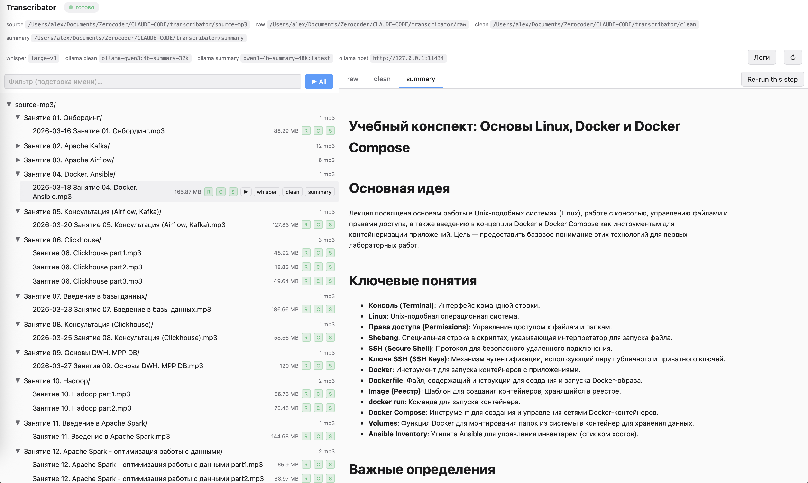
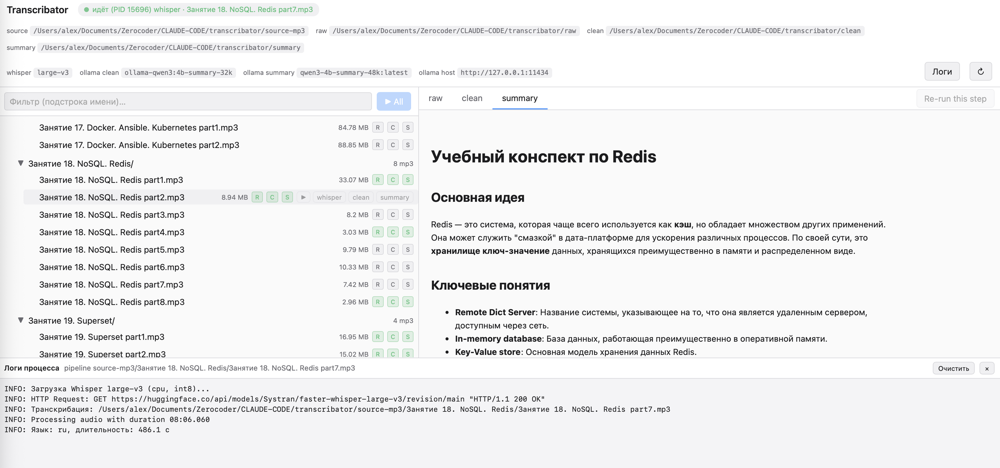

# Transcribator

**Локальный пайплайн транскрибации аудио: MP3 → черновик → чистый текст → краткое саммари.**

Полностью офлайн: распознавание речи через [Whisper Large-v3](https://github.com/SYSTRAN/faster-whisper),
а очистка и суммаризация — через локальные LLM в [Ollama](https://ollama.com).
Никакие аудио или тексты не покидают машину.



---

## Что это решает

У вас есть часовые лекции, подкасты или записи совещаний в MP3. Хочется:

- **читать** их как обычный текст (с таймкодами или без);
- **быстро понять суть** без перемотки — структурированное саммари с разделами;
- **не платить** облачным сервисам и **не сливать** контент в чужие API.

Transcribator берёт папку с MP3 и за один прогон выдаёт три файла:

```
source-mp3/.../Лекция.mp3
        ↓  Whisper Large-v3 (CPU, faster-whisper)
raw/.../Лекция.txt              ← «как распознал», с таймкодами
        ↓  Ollama (llama3.1-clean-32k)
clean/.../Лекция.txt            ← пунктуация, абзацы, убрано «эээ», «как бы»
        ↓  Ollama (gemma4:e2b-32k)
summary/.../Лекция.md           ← структурированное саммари в Markdown
```



## Для кого

- Студенты и преподаватели, которые работают с длинными аудиолекциями.
- Подкастеры, которые хотят текстовую расшифровку и краткое содержание выпусков.
- Команды, которые ведут аудио-протоколы встреч и хотят searchable-архив.
- Разработчики, которые хотят локальный self-hosted STT + summarization без API-ключей.

## Основная функция

- **Просмотр библиотеки** аудиофайлов в виде дерева папок с индикаторами
  «обработано / не обработано» по каждому из трёх шагов.
- **Запуск пайплайна** на отдельный файл, на папку или на всё сразу — одной кнопкой.
- **Перезапуск отдельного шага** (например, только clean) без повторной обработки Whisper.
- **Просмотр результатов** прямо в браузере: чистый текст и отрендеренный Markdown-саммари.
- **Живые логи** обработки в реальном времени (Server-Sent Events).
- **Работа из терминала** тоже возможна — один и тот же `transcribe.py` используется и GUI, и CLI.

## Что вы получаете на выходе

**`raw/*.txt`** — сырая расшифровка Whisper:

```
[00:00:00.000 -> 00:00:08.500] Добрый день, коллеги. Сегодня мы поговорим
про архитектуру Apache Kafka и разберём, как она устроена изнутри.
[00:00:08.500 -> 00:00:14.200] Начнём с основных понятий — топик, партиция,
брокер...
```

**`clean/*.txt`** — отредактированный текст (пунктуация, абзацы, убраны слова-паразиты):

```
Добрый день, коллеги. Сегодня мы поговорим про архитектуру Apache Kafka
и разберём, как она устроена изнутри.

Начнём с основных понятий: топик, партиция, брокер...
```

**`summary/*.md`** — структурированный конспект в Markdown:

```markdown
# Учебный конспект по Apache Kafka

## Основная идея
Apache Kafka — это open-source система для обмена сообщениями по модели
Publisher-Subscriber...

## Ключевые понятия
- **Топик** — категория/имя для потока сообщений...
- **Партиция** — единица параллелизма внутри топика...

## Когда использовать
Для event-streaming, логов, аналитики в реальном времени...
```

## Технологии

| Компонент | Что используется |
|---|---|
| Backend | Python 3.11+, Flask |
| Frontend | Vanilla JS SPA, HTML/CSS (без сборки и без зависимостей) |
| STT | [faster-whisper](https://github.com/SYSTRAN/faster-whisper) — Whisper Large-v3, CPU, int8 |
| LLM (clean/summary) | Ollama: `llama3.1-clean-32k:latest`, `gemma4:e2b-32k` |
| Markdown-рендер | Python `markdown` |
| Конфиг | `python-dotenv` + `prompts.toml` |

## Установка

### 1. Системные требования

- macOS / Linux
- Python 3.11 или новее
- ~10 ГБ свободного места (модели Whisper + Ollama)
- [Ollama](https://ollama.com/download) запущена локально

### 2. Клонирование и зависимости

```bash
git clone <repo-url> transcribator
cd transcribator
python3 -m venv .venv
.venv/bin/pip install -r requirements.txt
cp env.example .env
```

### 3. Загрузка моделей Ollama

```bash
ollama pull llama3.1-clean-32k:latest
ollama pull gemma4:e2b-32k
```

Проверьте, что ollama отвечает:

```bash
curl http://127.0.0.1:11434/api/tags
```

### 4. Запуск веб-интерфейса

```bash
./.venv/bin/python app.py
```

Откройте в браузере: **http://127.0.0.1:8765**

В UI вы увидите:

- слева — дерево папок `source-mp3/` с бейджами `R / C / S`
  (raw / clean / summary) — зелёный = файл уже создан, серый = нет;
- справа — вкладки `raw / clean / summary` для просмотра содержимого;
- внизу — панель логов в реальном времени во время обработки.

### 5. Запуск из терминала (CLI, без UI)

```bash
# Полный пайплайн на всю папку
.venv/bin/python transcribe.py pipeline source-mp3

# Только конкретный файл
.venv/bin/python transcribe.py pipeline source-mp3/Лекция.mp3

# Только один шаг — whisper / clean / summary
.venv/bin/python transcribe.py whisper source-mp3 --match "Part12"
.venv/bin/python transcribe.py clean raw --match "Part12" --force
.venv/bin/python transcribe.py summary clean --match "Part12"
```

`--force` перезаписывает уже созданные артефакты. Без него — пропускает.

## Структура проекта

```
transcribator/
├── transcribe.py               # CLI пайплайна (whisper/clean/summary/pipeline)
├── app.py                      # Flask-сервер веб-интерфейса
├── config.py                   # Settings + Prompts из .env / prompts.toml
├── status.py                   # Трекинг активной задачи (.transcribe-status.json)
├── prompts.toml                # Промпты для Ollama + список hotwords
├── requirements.txt            # faster-whisper, flask, markdown, python-dotenv
├── env.example                 # Шаблон .env (скопировать в .env)
│
├── source-mp3/                 # ← положите сюда ваши MP3
├── raw/                        # ← Whisper-транскрипты (создаются)
├── clean/                      # ← очищенные тексты (создаются)
├── summary/                    # ← саммари в Markdown (создаются)
│
├── templates/
│   └── index.html              # Единственный файл UI (vanilla JS SPA)
│
└── .claude/
    ├── agents/                 # Claude Code subagents (опционально)
    │   ├── transcribe-pipeline.md
    │   ├── transcribe-whisper.md
    │   ├── transcribe-clean.md
    │   └── transcribe-summary.md
    └── skills/                 # Claude Code skills (опционально)
        ├── transcribe-pipeline/
        ├── transcribe-whisper/
        ├── transcribe-clean/
        ├── transcribe-summary/
        └── start-web-ui/       # Запуск Flask-сервера по запросу
```

Папки `raw/`, `clean/`, `summary/` и файлы создаются при первом запуске.
Имена и пути — относительные к корню проекта (настраивается в `.env`).

## Конфигурация

Всё настраивается через `.env` (см. `env.example`):

| Переменная | Что делает | По умолчанию |
|---|---|---|
| `SOURCE_DIR` | Папка с исходными MP3 | `source-mp3` |
| `RAW_DIR` | Куда писать Whisper-транскрипты | `raw` |
| `CLEAN_DIR` | Куда писать очищенный текст | `clean` |
| `SUMMARY_DIR` | Куда писать саммари | `summary` |
| `OLLAMA_HOST` | Адрес Ollama | `http://127.0.0.1:11434` |
| `OLLAMA_CLEAN_MODEL` | Модель для шага clean | `llama3.1-clean-32k:latest` |
| `OLLAMA_SUMMARY_MODEL` | Модель для шага summary | `gemma4:e2b-32k` |
| `WHISPER_MODEL` | Размер модели Whisper | `large-v3` |
| `WHISPER_DEVICE` | CPU или CUDA | `cpu` |
| `WHISPER_BEAM_SIZE` | Beam search ширина | `9` |
| `WHISPER_NO_SPEECH_THRESHOLD` | Порог «тишины» (none = не пропускать) | `none` |

Горячие слова (имена, термины, специфичная лексика) добавляются в
`prompts.toml`, секция `[hotwords]`.

## Использование через Claude Code (опционально)

Если вы используете Claude Code, вы можете запускать обработку прямо из
чата на естественном языке. В репозитории настроены:

- **subagents** (`transcribe-pipeline`, `transcribe-whisper`, `transcribe-clean`,
  `transcribe-summary`) — каждый отвечает за свой шаг;
- **skills** (`start-web-ui` +4 транскриб-скилла) — обёртки с bash-скриптами.

Примеры запросов:

> «Запусти полный пайплайн для `Занятие 2. Apache Kafka/part12.mp3`»

> «Только summary, для всего `source-mp3/`»

> «Открой веб-интерфейс»

> «Перезапусти clean с `--force` для всех файлов»

Все они в итоге дёргают тот же `transcribe.py` через subprocess — никакой
параллельной реализации нет.

## Производительность

Whisper Large-v3 на CPU с `int8` — примерно **10–20× от длительности аудио**.
То есть час лекции = 10–20 минут обработки. Шаги clean и summary через
Ollama — обычно 1–3 минуты на файл (зависит от модели и длины).

Чтобы ускорить:

- запустите Whisper на GPU (`WHISPER_DEVICE=cuda` + `compute_type=float16`);
- используйте более лёгкие модели Ollama;
- запускайте пайплайн на нескольких файлах параллельно (разными процессами).

## Известные ограничения

- Параллельный запуск пайплайна на одном и том же файле не поддерживается —
  сервер возвращает `HTTP 409 Conflict`. Это by design: один процесс Flask
  = один активный subprocess `transcribe.py`.
- Аплоад MP3 из браузера не реализован — кладите файлы в `source-mp3/`
  вручную.
- Нет веб-интерфейса для редактирования `prompts.toml` или `.env` —
  правки делаются в текстовом редакторе и подхватываются при следующем
  запуске.

## Лицензия

MIT (или укажите свою).